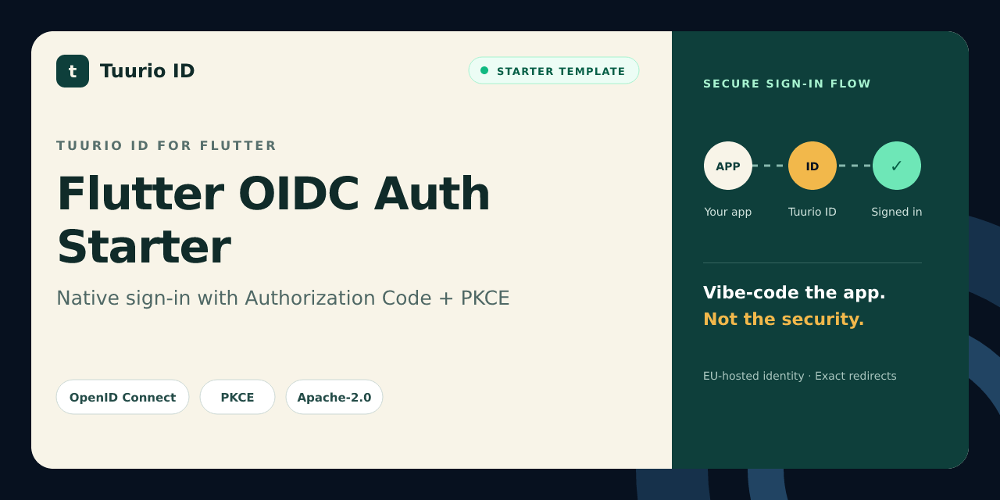

# Flutter OIDC Auth Starter

Flutter authentication starter for Tuurio ID using flutter_appauth, Authorization Code, PKCE, and native callback handling.

[](https://github.com/Tuurio/flutter-oidc-auth-starter/actions/workflows/verify.yml)



> Generated from [`Tuurio/auth_samples/auth_samples_flutter`](https://github.com/Tuurio/auth_samples/tree/main/auth_samples_flutter). Submit implementation fixes upstream so they are not replaced by the next synchronized release.

## What you get

- Standards-based OpenID Connect authentication with framework-native integration.
- Exact redirect and post-logout redirect handling.
- Protected-route and logout examples.
- A reviewed, pinned Tuurio provisioning workflow.

## Quickstart

1. Create a repository with **Use this template** or clone this repository.
2. Follow the framework-specific prerequisites below.
3. Review and run this pinned provisioning command:

```bash
npx manage-tuurio-id@1.1.6 init --framework flutter --project-dir . --auth browser --yes --output json --campaign github_flutter --no-open --no-wait
```

4. Approve the exact command, then complete the secure browser handoff yourself.
5. Run the build and verify one real sign-in and sign-out.

Never paste credentials, client secrets, authorization codes, tokens, session cookies, or environment-file contents into an agent chat. Browser and native applications are public clients and must not contain a client secret.

## Runtime and verification

- Runtime: Flutter 3.24+ / Dart 3.4+
- Package manager: Flutter pub
- Verification: `flutter pub get && flutter analyze`

## Security model

This starter uses OpenID Connect Authorization Code flow. Browser and native clients use PKCE S256 and contain no client secret. Redirect and post-logout redirect URIs must match exactly. Identity comes from the established OIDC integration or an authenticated UserInfo request; decoded JWT payloads are never treated as validation. Keep generated local environment files ignored and never commit tokens or credentials.

## Framework instructions

# Tuurio Auth Flutter Demo

A Flutter demo that signs in with OAuth 2.0 / OpenID Connect, shows safe session metadata, and supports logout.

## Integration guide

- Detailed integration guide: [Flutter example page](https://id.tuurio.com/public/developers/examples/flutter)
- General developer docs: [Tuurio ID developers](https://id.tuurio.com/public/developers)

## What you need

- A client registered in your Tuurio account (from the id.tuurio.com dashboard).
- The redirect URI configured for your Flutter app.

Make sure the client has these URLs configured:

```
Redirect URI: com.example.app://oauth2redirect
Post-logout Redirect URI: http://localhost:5173/
```

## Setup

1) Create a Flutter project (if you want a full platform scaffold):

```
flutter create auth_samples_flutter
```

2) Replace the generated `lib/` folder and `pubspec.yaml` with the files in this repo’s `auth_samples_flutter`.
3) Run:

```
flutter pub get
flutter run
```

## URL scheme setup (required)

Flutter needs platform-specific URL scheme configuration for the redirect URI `com.example.app://oauth2redirect`.

### Android

Add the AppAuth redirect receiver to `android/app/src/main/AndroidManifest.xml`:

```xml
<activity
    android:name="net.openid.appauth.RedirectUriReceiverActivity"
    android:exported="true">
    <intent-filter>
        <action android:name="android.intent.action.VIEW" />
        <category android:name="android.intent.category.DEFAULT" />
        <category android:name="android.intent.category.BROWSABLE" />
        <data
            android:scheme="com.example.app"
            android:host="oauth2redirect" />
    </intent-filter>
</activity>
```

Also set the manifest placeholder (Android Gradle):

```gradle
defaultConfig {
  manifestPlaceholders = [ appAuthRedirectScheme: "com.example.app" ]
}
```

### iOS

Add a URL type to `ios/Runner/Info.plist`:

```xml
<key>CFBundleURLTypes</key>
<array>
  <dict>
    <key>CFBundleURLSchemes</key>
    <array>
      <string>com.example.app</string>
    </array>
  </dict>
</array>
```

Or in Xcode: **Runner target → Info → URL Types** → add `com.example.app`.

## What you will see

- A login screen with a “Continue with Tuurio ID” button.
- After you authenticate, you are redirected back to the app.
- The app shows:
  - Token expiry time and scope without rendering token values.
  - UserInfo JSON (user profile).
  - Logout button that ends the session and returns to the app.

## Configuration

Edit `lib/auth_config.dart` with the values from your **Connect** page:

```
https://<tenantId>.id.tuurio.com/admin/clients
```

Replace the placeholders with values for your own tenant and native client:

```
authorizationEndpoint: https://YOUR_TENANT.id.tuurio.com/oauth2/authorize
tokenEndpoint: https://YOUR_TENANT.id.tuurio.com/oauth2/token
clientId: YOUR_CLIENT_ID
redirectUri: com.example.app://oauth2redirect
scopes: openid profile email
postLogoutRedirectUri: http://localhost:5173/
```

## Implemented snippet

The demo mirrors your provided `flutter_appauth` snippet in `lib/auth_controller.dart`:

- `authorizeAndExchangeCode` with `AuthorizationTokenRequest`.
- RP-initiated logout with `endSession` + `postLogoutRedirectUrl`.

## Notes

- Session state is stored in `SharedPreferences` to mimic the web demo’s session behavior.
- Make sure your Android/iOS bundle ID matches the URL scheme.

## Troubleshooting

**Login hangs after returning from the browser**
- Verify the redirect URI matches exactly.
- Ensure the URL scheme is configured on both Android and iOS.

**No matching state found**
- Avoid launching multiple auth flows in parallel.
- Confirm the redirect URI matches the one configured in your IdP.


## License

Licensed under the Apache License, Version 2.0. See [`LICENSE`](./LICENSE).
